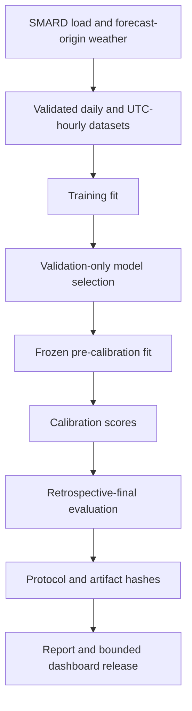

# Technical Design

## Overview

This project is a layered Python forecasting pipeline. It acquires and validates German load
and forecast-origin weather, builds daily and 24-step hourly features, selects models on a
chronological validation period, calibrates uncertainty on a later period, and publishes a
hash-linked retrospective release to the report and interactive dashboard.

<!-- loadfc:generated-start -->
### Release results

- **Period:** 01 Jan 2026 to 04 Aug 2026; n=216 days.
- **Daily forecast:** Ensemble. MAE 1003.6 MW, MAPE 1.867%, and MASE 0.445. Reference models: Naive (t-1) MAPE 7.025% (n=216); Seasonal naive (t-7) MAPE 5.575% (n=216).
- **Hourly forecast:** Residual hybrid. Daily-total alignment reduced MAE from 1627.6 MW to 1557.7 MW (-4.30%). The result contains n=5183 hourly values. The daily model was LightGBM.
- **Model comparison:** Validation MAE was 1465.3 MW for Residual hybrid and 1471.0 MW for Direct LightGBM. The paired difference on the final data was +1.9 MW. Its 95% range was [-48.8, 52.1] MW across 216 days. This range includes zero, so the data do not show a clear winner.
- **Uncertainty ranges:** Symmetric 90%: target 90%, measured coverage 84.89%, mean width 5573.1 MW, interval score 8831.6 MW, n=5183; Adaptive 90%: target 90%, measured coverage 89.95%, mean width 6529.3 MW, interval score 8250.5 MW, n=5183; CQR 90%: target 90%, measured coverage 86.51%, mean width 7550.2 MW, interval score 10567.7 MW, n=5183.
- **Release check:** source `4dacfc64c5bff25b66263ced93d6c14cbc1257b1`; daily protocol `ef5d669f14abd4e8b58a35cbd0c4c500fb070817dd4e12a227e9b218b1719247`; hourly protocol `bf649cb8b18e90d447fef2a69314fe61f526d6ab91313c3c5b32755d30221258`; bundle `bdfbd6a7b98efa7b8f2279206bd17e0a400e7740086e5026a6d063e6913d3588`.
- **Scope:** The final period was already examined. These results describe this data period and do not state future accuracy.
<!-- loadfc:generated-end -->

## System flow



The main entry point is `scripts/run_pipeline.py`. It runs each generation stage in a temporary
staging tree, validates the result manifest, builds the dashboard contract, validates again, and
then promotes the complete release as one coordinated operation.

## Key modules and interfaces

| Area | Interface | Responsibility |
|---|---|---|
| Configuration | `loadfc.config.Config` | Loads `config.yaml`, resolves project paths, and validates split and model settings. |
| Hourly identity | `loadfc.data.hourly.canonical_utc_index` | Normalizes hourly inputs to a unique, complete UTC grid. |
| Forecast provenance | `loadfc.evaluation.provenance` | Adds forecast origin, valid time, horizon, and weather-availability identity to persisted predictions. |
| Evaluation protocol | `loadfc.evaluation.protocol` | Validates protocol records, creates stable SHA-256 fingerprints, and rejects incompatible calibration/final artifacts. |
| Reconciliation | `loadfc.evaluation.hourly.reconcile_to_daily_means` | Scales the horizon-24 hourly profile to the selected daily forecast mean. |
| Uncertainty | `loadfc.evaluation.conformal` | Produces fixed, adaptive, and quantile-based conformal intervals and their evidence rows. |
| Release identity | `loadfc.tracking` | Computes source, file, and bundle hashes; it does not store fitted models. |
| Presentation | `loadfc.presentation` and `scripts/build_dashboard_data.py` | Validate result evidence and produce the bounded `release.json` dashboard contract. |

## System rules

1. Training data fits candidates for validation-only model selection.
2. Selected point, daily-anchor, and quantile models are fit through the validation boundary
   before calibration.
3. Calibration data supplies conformal scores; it does not reselect the architecture.
4. Retrospective-final data evaluates the frozen selection and is not used for tuning.
5. Reconciliation is applied before hourly conformal scores and final interval evidence are
   calculated.
6. Every persisted evidence stream carries its evaluation role, stream ID, protocol fingerprint,
   point-state policy, and interval-state policy.

## Forecast reconciliation

For each complete German local day, the system predicts an hourly profile and a daily mean. It
then applies:

```math
\hat{y}^{rec}_{d,h}
=
\hat{y}^{hourly}_{d,h}
\times
\frac{\hat{y}^{daily}_{d}}
{\frac{1}{|H_d|}\sum_{j \in H_d}\hat{y}^{hourly}_{d,j}}
```

The factor preserves the relative hourly profile while making its local-day mean equal the daily
anchor. `reconcile_to_daily_means` accepts complete 23-, 24-, and 25-hour Berlin days and rejects
duplicate UTC identities, missing anchors, incomplete days, non-finite values, and non-positive
profile means or anchors. `reconciliation_invariant_rows` records the per-day delta and checks it
against a finite non-negative tolerance.

## ADR-001: Chronological data partitions

**Status:** Accepted

The experiment uses four ordered, non-overlapping partitions: training, validation, calibration,
and retrospective final. Their exact boundaries come from `config.yaml`. Random splits could mix
past and future regimes, so they are not used for model selection or final evidence.

## ADR-002: Direct 24-step hourly forecasts

**Status:** Accepted

Hourly candidates predict valid times directly for horizons 1 through 24. The feature identity
contains both `forecast_origin` and `valid_time`, while the model features include horizon,
local-hour cycles, lag-24, and lag-168 terms. Direct prediction avoids recursive error propagation.

## ADR-003: Daily-mean reconciliation

**Status:** Accepted

The daily model controls the forecast level and the hourly model controls the profile shape. Model
selection uses reconciled horizon-24 validation MAE. The retrospective release reports raw and
reconciled MAE from the same final forecast rows and records one reconciliation invariant per
complete local day.

## ADR-004: Validation-only model selection

**Status:** Accepted

The release preserves the model selected on validation evidence. Calibration and retrospective
candidate comparisons cannot change that choice. The daily ensemble's persistence-weather change
is likewise recorded as a validation-only decision in
`results/metrics/low_risk_improvement_decision.json`.

## ADR-005: Paired local-day block bootstrap

**Status:** Accepted

Hourly errors within a day and across nearby days are dependent. The comparison first computes a
paired MAE difference for each complete local day, groups those differences into seven-day blocks,
and resamples the blocks 10,000 times with seed 42. The reported 95% interval is retrospective
uncertainty evidence, not a reason to replace the validation-selected model.

## ADR-006: Frozen conformal calibration

**Status:** Accepted

Point, daily-anchor, and quantile models share the same pre-calibration fit boundary. Frozen models
predict both calibration and retrospective-final periods, and reconciliation occurs before score
calculation. Fixed symmetric and CQR evidence is empirical retrospective coverage. Adaptive
intervals update only after the actual value arrives and are labeled as prequential monitoring
evidence without an unconditional time-series coverage guarantee.

## ADR-007: Protocol and release provenance

**Status:** Accepted

Each evaluation protocol records the source revision, configuration hash, ordered feature columns,
model parameters, seed, split roles, weather strategy, state policies, final role, and selection
evidence. Canonical JSON serialization produces a protocol fingerprint. Calibration and
retrospective artifacts must agree on stream identity and state policy before they are combined.

`results/run_summary.json` binds the source revision, `config.yaml`, `uv.lock`, protocol
fingerprints, and generated artifact hashes into one bundle fingerprint. Presentation artifacts
embed that identity, and `scripts/validate_results.py` checks the dashboard's source hashes against
the generated evidence.

## ADR-008: Data, time, and weather-origin validation

**Status:** Accepted

The ingest boundary requires finite positive load values and weather within configured physical
ranges. Hourly data is converted to UTC and must be timezone-aware, unique, complete, and aligned
to whole-hour instants. Forecast artifacts retain `forecast_origin`, `valid_time`,
`weather_source_run`, and `weather_availability_assumption`; hourly artifacts also verify that the
horizon agrees with the origin-to-valid-time distance.

The operational weather archive is labeled with its repository-visible assumption: previous-day-1
weather is treated as available 24 hours before valid time because the exact provider run timestamp
is unavailable. The limitation is carried into the dashboard contract.

## ADR-009: Atomic release generation

**Status:** Accepted

A canonical release starts only from a clean committed source. All expensive stages, the report
build, both validation passes, and dashboard generation run against a temporary staging root.
Promotion requires the staged results directory, dashboard contract, generated report data, report
PDF, and managed documentation surfaces to exist together. Existing destinations are backed up;
if any replacement fails, every earlier replacement is reversed. Stale backups block promotion.

The repository keeps the compact protocol manifest, validation decision, run summary, dashboard
contract, and report outputs. Detailed result tables are regenerated by `scripts/run_pipeline.py`;
the manual `reproduce.yml` workflow uploads the full `results/` tree and report PDF as a 30-day CI
artifact instead of versioning the generated CSV tables.

## ADR-010: Bounded dashboard contract

**Status:** Accepted

`scripts/build_dashboard_data.py` reads only schema-checked, finite, retrospective evidence whose
file hashes match the run summary. It emits a size-bounded JSON contract for the React dashboard
and updates the contract hash and run summary together with rollback on failure. The dashboard and
report therefore consume the same selected models, periods, metrics, uncertainty labels, and bundle
identity.

## Datetime resolution

Pandas datetime indexes can use different storage resolutions. Feature time position is therefore
computed with timestamp arithmetic rather than a fixed divisor over raw integer storage:

```python
position = ((frame.index - utc_epoch) / pd.Timedelta(hours=1)).to_numpy(dtype="float64")
```

This keeps hourly trend and Fourier phase correct regardless of the datetime storage unit.

## Verification

Fast source gate:

```bash
uv run ruff check src scripts tests
uv run mypy src
uv run pytest --cov=loadfc --cov-report=term-missing --cov-fail-under=80
```

Dashboard gate:

```bash
npm ci --prefix dashboard
npm --prefix dashboard test -- --run
npm --prefix dashboard run build
```

Full release reproduction requires Tectonic on `PATH` and a clean committed checkout:

```bash
uv sync --extra dev --extra explain
uv run python scripts/run_pipeline.py
```
