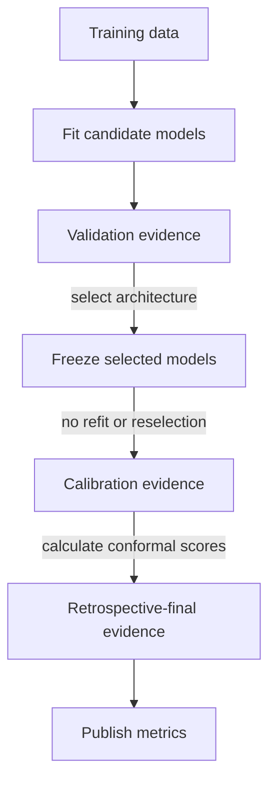

# Technical Design

<!-- loadfc:generated-start -->
Release results are generated from the checked source revision.
<!-- loadfc:generated-end -->

## System flow



## System rules

The hourly release uses these rules:

1. Validation data selects the model architecture.
2. Training data fits the selected models before calibration.
3. Calibration data produces conformal scores.
4. Retrospective-final data measures the frozen system.
5. Both interval methods use the same point forecasts.
6. The MLflow artifact applies the reported reconciliation operation.

## Forecast reconciliation

The system predicts an hourly profile and a daily mean. It then reconciles the
two forecasts.

```math
\hat{y}^{rec}_{d,h}
=
\hat{y}^{hourly}_{d,h}
\times
\frac{\hat{y}^{daily}_{d}}
{\frac{1}{|H_d|}\sum_{j \in H_d}\hat{y}^{hourly}_{d,j}}
```

The operation preserves the relative hourly profile. The reconciled daily mean
equals the direct daily forecast.

The implementation accepts complete local days. A local day can contain 23,
24, or 25 hours. The implementation rejects an incomplete day. It also rejects
nonfinite predictions and nonpositive daily forecasts.

## ADR-001: Chronological data partitions

**Status:** Accepted

The experiment uses four chronological partitions: training, validation,
calibration, and retrospective final. Exact boundaries come from `config.yaml`.

Random data partitions can mix past and future regimes. Chronological
partitions prevent this condition.

## ADR-002: Direct hourly forecasts

**Status:** Accepted

The hourly models predict each valid hour directly. The feature set contains
the forecast horizon. It also contains local-hour cyclical terms.

Lag-24 represents the previous day. Lag-168 represents the previous week.
Direct forecasts prevent recursive error propagation.

## ADR-003: Daily-mean reconciliation

**Status:** Accepted

The daily model controls the forecast level. The hourly model controls the
profile shape.

The generated release evidence above reports raw and reconciled MAE from the
same retrospective-final forecast rows.

## ADR-004: Validation model selection

**Status:** Accepted

The release keeps the validation-selected model. Later candidate comparisons
are retrospective evidence and do not change that selection.

## ADR-005: Day-block bootstrap

**Status:** Accepted

Errors from hours in one day are dependent. The analysis first calculates one
MAE difference for each local day, then resamples paired day blocks.

The procedure uses 10,000 bootstrap samples. One local day is the effective
sample unit.

## ADR-006: Frozen conformal calibration

**Status:** Accepted

The point, daily, and quantile models use the same pre-calibration data
boundary.

The frozen models predict the calibration and retrospective-final periods.
Reconciliation occurs before score calculation.

## ADR-007: MLflow model behavior

**Status:** Accepted

MLflow stores `ReconciledForecaster`. The object contains both fitted models.
It also contains both feature schemas and the reconciliation operation.

Artifact replay is checked against the persisted evaluation predictions.

The sklearn model format uses Python serialization. Load artifacts only from a
trusted registry.

## ADR-008: Data and time validation

**Status:** Accepted

The ingest layer applies these checks:

- Load values are finite and positive.
- Weather values are within configured physical ranges.
- UTC timestamps are timezone-aware.
- UTC timestamps are unique and complete.
- All timestamps are on the hourly grid.

The telemetry layer compares indexes before a join. It also checks that all
interval bounds are finite.

## Datetime resolution

Pandas can store datetime values in different units. Raw `.asi8` values expose
the storage unit. A fixed nanosecond divisor can therefore produce an invalid
time scale.

The feature code uses this calculation:

```python
position = (timestamp_index - utc_epoch) / pd.Timedelta(hours=1)
```

A regression test uses a `datetime64[us]` index. The test verifies one-hour
increments and the weekly Fourier phase.

## Verification

```bash
uv run ruff check src scripts tests
uv run mypy src
uv run pytest --cov=loadfc --cov-report=term-missing --cov-fail-under=80
uv run python scripts/validate_results.py
uv run python scripts/render_report_data.py
tectonic -X compile report/technical-report-en.tex
```
