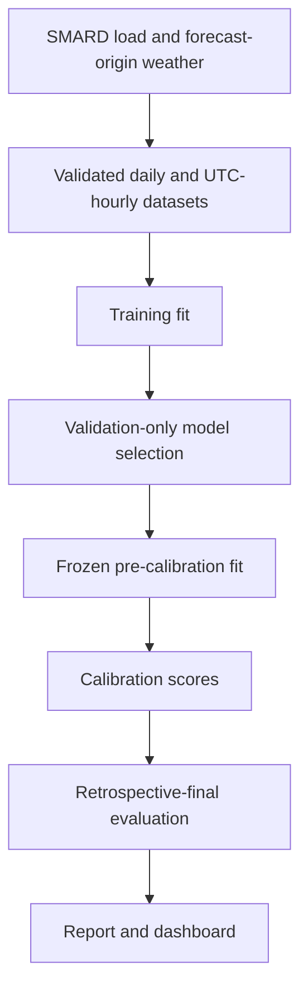

# Technical Design

## Overview

This project is a layered Python forecasting pipeline. It acquires and validates German load
and forecast-origin weather, builds daily and fixed 24-hour-ahead features, selects models on a
chronological validation period, calibrates uncertainty on a later period, and publishes the same
retrospective evidence to the report and interactive dashboard. Numerical results live in the
[README](../README.md#results) and [technical report](../report/technical-report-en.pdf).

## System flow



The main entry point is `scripts/run_pipeline.py`. It runs each generation stage in a temporary
staging tree, validates the result manifest, builds the dashboard contract, validates again, and
then promotes the complete release as one coordinated operation.

## Key modules and interfaces

| Area | Interface | Responsibility |
|---|---|---|
| Configuration | `loadfc.config.Config` | Loads `config.yaml`, resolves project paths, and validates split and model settings. |
| Hourly identity | `loadfc.data.hourly.canonical_utc_index` | Normalizes hourly inputs to a unique, complete UTC grid. |
| Forecast provenance | `loadfc.evaluation.provenance` | Adds forecast origin, valid time, horizon, and weather-availability identity to persisted predictions. |
| Evaluation protocol | `loadfc.evaluation.protocol` | Validates protocol records, creates stable SHA-256 fingerprints, and rejects incompatible calibration/final artifacts. |
| Reconciliation | `loadfc.evaluation.hourly.reconcile_to_daily_means` | Scales the horizon-24 hourly profile to the selected daily forecast mean. |
| Uncertainty | `loadfc.evaluation.conformal` | Produces fixed, adaptive, and quantile-based conformal intervals and their evidence rows. |
| Presentation | `loadfc.presentation` and `scripts/build_dashboard_data.py` | Validate result evidence and produce the report and static dashboard input. |

## System rules

1. Training data fits candidates for validation-only model selection.
2. Selected point, daily-anchor, and quantile models are fit through the validation boundary
   before calibration.
3. Calibration data supplies conformal scores; it does not reselect the architecture.
4. Retrospective-final data evaluates the frozen selection and is not used for tuning.
5. Reconciliation is applied before hourly conformal scores and final interval evidence are
   calculated.

## Forecast reconciliation

For each complete German local day, the system predicts an hourly profile and a daily mean. It
then applies:

```math
\hat{y}^{rec}_{d,h}
=
\hat{y}^{hourly}_{d,h}
\times
\frac{\hat{y}^{daily}_{d}}
{\frac{1}{|H_d|}\sum_{j \in H_d}\hat{y}^{hourly}_{d,j}}
```

The factor preserves the relative hourly profile while making its local-day mean equal the daily
anchor. `reconcile_to_daily_means` accepts complete 23-, 24-, and 25-hour Berlin days and rejects
duplicate UTC identities, missing anchors, incomplete days, non-finite values, and non-positive
profile means or anchors. `reconciliation_invariant_rows` records the per-day delta and checks it
against a finite non-negative tolerance.

## ADR-001: Chronological data partitions

**Status:** Accepted

The experiment uses four ordered, non-overlapping partitions: training, validation, calibration,
and retrospective final. Their exact boundaries come from `config.yaml`. Random splits could mix
past and future regimes, so they are not used for model selection or final evidence.

## ADR-002: Fixed 24-hour-ahead hourly evaluation

**Status:** Accepted

Hourly candidates predict valid times directly for horizons 1 through 24. The headline evaluation
uses the horizon-24 slice, so every valid hour is forecast exactly 24 hours earlier. Those rows do
not share one common issue time and must not be described as a conventional next-day 24-hour
profile. The feature identity contains both `forecast_origin` and `valid_time`; direct prediction
avoids recursive error propagation.

## ADR-003: Daily-mean reconciliation

**Status:** Accepted

The daily model controls the forecast level and the hourly model controls the profile shape. Model
selection uses reconciled horizon-24 validation MAE. The retrospective release reports raw and
reconciled MAE from the same final forecast rows and records one reconciliation invariant per
complete local day.

## ADR-004: Validation-only model selection

**Status:** Accepted

The release preserves the model selected on validation evidence. Calibration and retrospective
candidate comparisons cannot change that choice. Forecast-origin weather is part of the study
definition; the persistence run is descriptive ablation evidence, not a selection candidate.

## ADR-005: Paired local-day block bootstrap

**Status:** Accepted

Hourly errors within a day and across nearby days are dependent. The comparison first computes a
paired MAE difference for each complete local day, groups those differences into seven-day blocks,
and resamples the blocks 10,000 times with seed 42. The reported 95% interval is retrospective
uncertainty evidence, not a reason to replace the validation-selected model.

## ADR-006: Frozen conformal calibration

**Status:** Accepted

Point, daily-anchor, and quantile models share the same pre-calibration fit boundary. Frozen models
predict both calibration and retrospective-final periods, and reconciliation occurs before score
calculation. Fixed symmetric and CQR evidence is empirical retrospective coverage. Adaptive
intervals update only after the actual value arrives and are labeled as prequential monitoring
evidence without an unconditional time-series coverage guarantee.

## Input and time validation

The ingest boundary requires finite positive load values and weather within configured physical
ranges. Hourly data is converted to UTC and must be timezone-aware, unique, complete, and aligned
to whole-hour instants. Forecast artifacts retain `forecast_origin`, `valid_time`,
`weather_source_run`, and `weather_availability_assumption`; hourly artifacts also verify that the
horizon agrees with the origin-to-valid-time distance.

The operational weather archive is labeled with its repository-visible assumption: previous-day-1
weather is treated as available 24 hours before valid time because the exact provider run timestamp
is unavailable. The limitation is carried into the dashboard contract.

## Release checks

The full command runs in a staging directory, validates generated evidence, and promotes the report
and dashboard together. Detailed CSV tables are regenerated on demand and uploaded by the manual
`reproduce.yml` workflow rather than stored in Git. These checks support reproducibility but are not
part of the forecasting method.

## Parameter provenance

The tree-model parameters in `config.yaml` are frozen values inherited from earlier experimentation.
The complete search trials are not present, so the project does not claim that the original search
can be replayed. The current study is reproducible from those committed parameters onward, and
calibration or final outcomes do not alter them.

## Verification

Fast source gate:

```bash
uv run ruff check src scripts tests
uv run mypy src
uv run pytest --cov=loadfc --cov-report=term-missing --cov-fail-under=80
```

Dashboard gate:

```bash
npm ci --prefix dashboard
npm --prefix dashboard test -- --run
npm --prefix dashboard run build
```

Full release reproduction requires Tectonic on `PATH` and a clean committed checkout:

```bash
uv sync --extra dev --extra explain
uv run python scripts/run_pipeline.py
```
